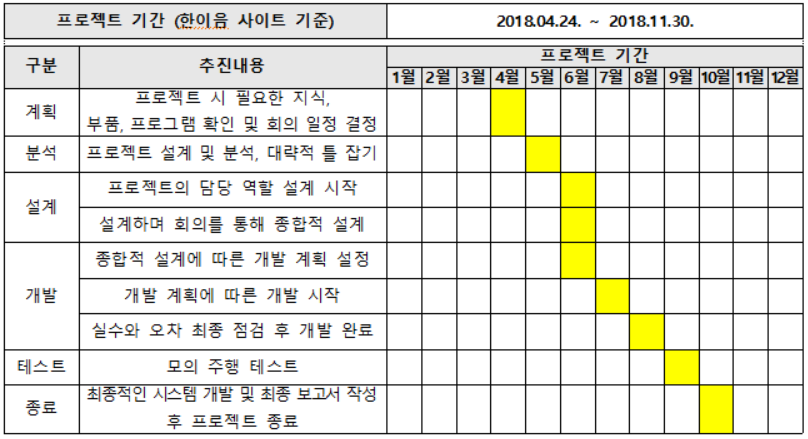
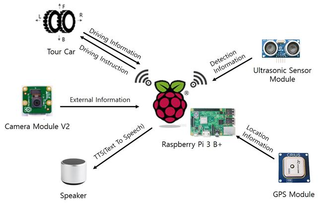
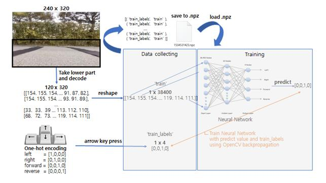

<h2>SmartTourShuttle</h2>
공모전 제출영상 링크 : https://www.youtube.com/watch?v=kLG_29WT5aU

<h3>프로젝트 명</h3>

단거리 관광을 위한 라즈베리파이 기반 자율주행 무인셔틀

<h3>프로젝트 수행일정</h3>

<h3>작품 구성도</h3>

  

<h3>작품 기능</h3>
| **기능**                | **설명**                             |
| ----------------------- | ------------------------------------ |
|자율주행                 | 사전에 훈련된 데이터로 자율주행 시행   |
|영상 스트리밍            | 파이카메라의 영상을 실시간으로 확인     |
|신호등 및 정지신호 인식   | 전방의 신호등의 현재 상태를 인식       |
|지도상 현재 위치 제공     | 지도상 위치를 홈페이지를 통해 제공     |
|Text-To-Speech          | 원하는 텍스트를 음성으로 변환          |
|전방 장애물 감지         | 초음파 센서로 전방의 물체 감지         |
|음성 안내               | 스피커를 통하여 음성으로 정보 제공      |
|현재 위치 인식           | GPS을 통하여 셔틀의 현재 위치 수신     |

